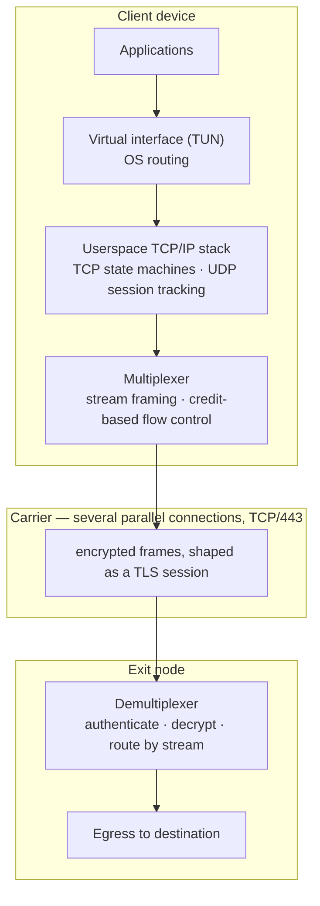

# NRXP

**The transport protocol behind [Netrunner VPN](https://netrunner-vpn.com).**

*Read this in [Russian / по-русски](README.ru.md).*

---

## What this repository is

This repository is the **public description of NRXP** — its design goals, structure,
cryptographic model, and honest limits.

It does **not** contain the multiplexer (per-stream flow control, multipath failover) or the
production node/client applications — those stay closed-source, in a private repository,
with no roadmap to open them: unlike the pieces below, they are complete, deployable
implementations whose value is inseparable from their exact tuning.

Two other components — the frame format and crypto codec, and the TLS-mimicry layer used at
the handshake boundary — **are** published as real, buildable source in this same
repository, under [`engine/`](engine) and [`logger/`](logger), with their calibration data
(not their mechanism) redacted; see [ENGINE.md](ENGINE.md) for the build instructions and
license. The rule applied there: publish *how* something works (algorithms, data
structures, invariants), redact *the exact numbers* a specific deployment is tuned to
(record-length quantization parameters, key-rotation thresholds, browser-fingerprint byte
lists) — the first doesn't help build a detector, the second is exactly what a detector is
built from. ENGINE.md lists precisely what is and isn't included, file by file.

If you are here to evaluate whether the protocol is sound, [Security model](#security-model)
and [What NRXP does not protect against](#what-nrxp-does-not-protect-against) are the two
sections worth your time. If you want to know why the byte-level details are missing,
[that question has its own section](#why-the-numbers-are-not-here).

---

## What NRXP is

NRXP is a transport protocol for carrying a full network layer across a hostile path.

It is not a proxy protocol. A proxy forwards connections; NRXP carries **IP traffic** —
the client owns a virtual network interface, terminates TCP and UDP in userspace, and
multiplexes the resulting streams into a single encrypted carrier that leaves the device
as ordinary-looking HTTPS on TCP port 443.

One sentence: **a multiplexed, multipath L3 VPN that travels in the shape of a normal
web session.**

---

## Why it exists

The mainstream circumvention protocols — VLESS, VMess, Trojan — are proxies wrapped in
TLS. They work, and on a good link the difference from NRXP is invisible. The gap opens
on the links people actually use: mobile, congested, roaming, satellite, hotel Wi-Fi.

Three specific failures NRXP was built to remove:

**Every new connection pays a full round trip.** A proxy without multiplexing opens a
new TCP connection and a new TLS handshake per destination — two round trips, each time,
to every domain. A page that touches ten domains pays that ten times over. At 200 ms of
latency that is several seconds of nothing happening, and it is most of what people mean
when they say "the internet is slow through a VPN".

**One dropped carrier connection kills everything on it.** Single-connection protocols
put every stream in one TCP socket. A lost packet stalls all of them (head-of-line
blocking); a dropped connection ends all of them. Walking into a lift or switching from
Wi-Fi to LTE means reconnecting and, often, restarting a download.

**The receive window becomes the speed limit.** Widely used multiplexers ship a fixed
per-stream window around 256 KiB. Throughput of a single stream cannot exceed
window ÷ RTT, so at 300 ms that is roughly 7 Mbit/s regardless of the link — the actual
reason "I pay for 100 Mbit and get 5 through the VPN".

NRXP addresses all three in the transport itself rather than in configuration.

---

## Architecture

Four layers, each with one job:

| Layer | Responsibility |
|---|---|
| **Capture (L3)** | A TUN interface plus OS routing rules pull traffic off the device. A userspace TCP/IP stack ([a fork of `smoltcp`](https://github.com/nineAp/nxrp-smoltcp)) runs the TCP state machines and tracks UDP sessions in-process — no `tun2socks` helper, no second hop through a local proxy. |
| **Streams** | Each captured connection becomes a numbered stream. Streams open, carry data, and close inside the tunnel; the carrier connections stay up across all of it. |
| **Frames** | Stream data is cut into frames, each independently encrypted and authenticated, then written into the carrier. Several frames may share one carrier record; one frame never straddles two. |
| **Carrier** | A TLS-shaped session on TCP/443 — the handshake and the record structure are what a network observer sees. |

The core is Rust and platform-independent. Platform code (TUN handling, routing, VPN
service lifecycle) sits above it, and Android gets native `.so` libraries per architecture
with Kotlin bindings generated through UniFFI — not a wrapper around someone else's binary.

---

## How a session works

**Establishing.** The client opens the carrier and sends a first message shaped like a
browser's TLS `ClientHello`. Both sides contribute an ephemeral public key and a random
salt; both derive the same shared secret independently, and nothing that could serve as a
key ever crosses the wire. Where the client has been provisioned with its node's
long-term public key, that key is folded into the same derivation — an interceptor
without it cannot arrive at the shared secret, so impersonating the node fails as
"the data does not decrypt" rather than as a certificate warning.

The shared secret is never used as a key directly. It goes through HKDF-SHA256, which
expands it into several cryptographically independent values: a separate encryption key
per direction, and a separate authentication key. Roles are mirrored, so one side's write
key is the other's read key.

**Carrying.** Every frame is sealed with ChaCha20-Poly1305 — confidentiality and integrity
from one primitive, in one operation, with the tag verified before any plaintext reaches a
parser. Nonces are never transmitted: both sides compute them from session material and a
per-direction counter. Two consequences follow, and the second matters more than the first:

- Nonce reuse under one key — the one way to catastrophically break this cipher — is
  excluded by construction, not by a runtime check.
- A dropped, duplicated, or reordered frame desynchronises the counters and breaks
  decryption immediately. Replay and reordering inside a live session are not defended
  against; they are structurally impossible.

**Closing.** Streams close independently. The carrier connections outlive them, which is
what makes the next stream free.

---

## Multiplexing and flow control

A new stream costs **zero round trips**. The carrier connections are already established
and already keyed, so opening a connection to a new destination is a frame, not a
handshake. This is the single largest perceptible difference from VLESS or Trojan on a
high-latency link.

Flow control is **end-to-end and credit-based**: a receiver grants a sender an explicit
budget and tops it up as data is consumed, so a slow destination cannot let the tunnel
buffer without bound.

The per-stream window **starts in the megabytes and scales with measured RTT, up to
16 MiB**. This is the mechanism that removes the fixed-window speed ceiling:

| Link RTT | Ceiling with a fixed 256 KiB window | Ceiling with NRXP |
|---|---|---|
| 50 ms | ~42 Mbit/s | ~336 Mbit/s |
| 300 ms | **~7 Mbit/s** | ~447 Mbit/s |
| 600 ms (satellite) | **~3.5 Mbit/s** | ~224 Mbit/s |

(Ceiling = window ÷ RTT. The window grows with measured RTT, so the worse the link, the
more headroom is allocated.)

---

## Multipath and failover

A session runs over **several parallel carrier connections**, not one. Each stream is
sticky to a connection so ordering is preserved, and:

- **A failed connection does not end a stream.** The stream migrates to a healthy sibling
  and the in-flight frame is re-sent. A download continues; the application sees nothing.
- **Head-of-line blocking is divided, not eliminated.** A lost packet stalls the streams on
  that one connection instead of every stream in the session.
- **Network changes survive.** Moving between Wi-Fi and mobile data does not require the
  application-visible session to restart.

This is not connection migration in the QUIC sense, which moves one connection to a new
address. It is path redundancy: several independent paths, live simultaneously, with
streams free to move between them.

---

## Security model

Every cryptographic primitive here is a standard, audited implementation. **There is no
custom cryptography in the project** — not one arithmetic operation. What is bespoke is
the composition, and it is deliberately arranged so as not to introduce assumptions of
its own.

| Function | Primitive |
|---|---|
| Key agreement | X25519, ephemeral, single-use per session |
| Node authentication | Second Diffie–Hellman against the node's long-term key, folded into the same key material |
| Key derivation | HKDF-SHA256, per-direction and per-purpose labels |
| Encryption and integrity | ChaCha20-Poly1305 |
| Frame authenticator | HMAC-SHA256, time-bound, verified in constant time |

The properties this composition is built to give:

**The node is authenticated before application data is carried.** Before connecting, the
app obtains the selected node's long-term public key together with its route from the
authenticated Netrunner control plane over HTTPS. The private half never leaves the node.
A second X25519 exchange is folded into the session key material, so an in-path impostor
without the private key derives different keys and the connection fails before application
data is sent. Production nodes run in strict mode: clients without node credentials are
rejected, and downgrade to the former anonymous handshake is disabled.

**Forward secrecy that holds.** Session private keys are ephemeral and consumed exactly
once — the type system makes reuse unrepresentable, and after the shared secret is computed
the key is no longer in memory. Traffic recorded today does not decrypt tomorrow, even
against an adversary who later obtains full access to the server. No secret carries between
sessions.

**Integrity from the cipher, not bolted on.** Historic protocol failures in this space
(MTProto is the canonical study) came overwhelmingly from hand-assembling integrity on top
of a cipher: a hash over plaintext, unverified padding, replay ordering left to the server.
NRXP uses AEAD in its intended mode, where encryption and authentication are inseparable
by construction. A failed tag is a closed connection, not a parse error.

**Replay of a session is rejected at the door.** The in-session counter protects data
inside a live session; a recorded session replayed later as a *new* connection is a
different attack, and it is the standard way an active prober tries to tell a proxy from a
web server. So every frame carries a short authenticator bound to the session key and to
the current time interval. The very first message has no session keys yet, so its
authenticator is built on the node's long-term secret and bound to the parameters of that
specific connection — replayed later, it does not fit even inside its time window. A
rejected frame closes the connection without producing a distinguishable response. A
tolerance for clock skew and network delay exists; beyond it the authenticator is invalid.

**Constant-time verification, as a fixed invariant.** Authenticator checking always runs
the full candidate set and compares bytes by accumulating difference — no early exit, no
branch on an intermediate result. The duration does not depend on what arrived or on
whether it matched. This is pinned in the code as an invariant with a test, not left to
chance.

**Unsolicited connections get a website.** A scanner probing the port is served a real,
working site. It sees a web server, not something that refuses to speak and thereby
announces itself.

---

## Blending in

Encryption answers "can it be read". A circumvention protocol has a second, independent
problem: **an observer should not be able to tell that a tunnel is what they are looking
at.** Encrypted noise is visibly encrypted noise, and the cipher does nothing for this.

Three layers, each closing a different signal:

- **Shape.** Both establishment and the ongoing flow fit the structure DPI classifies as
  ordinary HTTPS traffic on TCP/443.
- **Fingerprint.** Looking like TLS is not enough — it has to look like a *specific*
  browser. This layer is the [`netrunner-tls-engine`](ENGINE.md) referenced above.
  The first packet of a session reproduces the fingerprint of a real, current
  browser in full, including the order and content of extensions, which is exactly what
  modern classifiers use to separate "a browser" from "a custom client pretending to be
  one". The profile rotates per session identity rather than per reconnect attempt:
  changing TLS identity between reconnects from one address is itself more conspicuous
  than a stable fingerprint.
- **Statistics.** Message lengths are a signature too. The batching and quantization
  mechanism is public source in [`netrunner-tls-engine`](ENGINE.md) (`nrxp::codec`) —
  padding is applied with parameters chosen randomly per connection rather than from a
  global constant (the exact ranges are the one part redacted there), several frames are
  batched into one record so observed record size reflects the writer's batching rather
  than any single request, and keepalive traffic is jittered rather than periodic. Padding
  is skipped for bulk transfers, where it hides nothing and only costs throughput.

Padding sits **under** encryption and **inside** the authenticated region. An observer can
neither distinguish it from data nor strip it in transit — unlike padding schemes applied
outside the sealed envelope.

**Stated plainly:** the goal here is to look like HTTPS and to not stand out, and the
protocol is engineered toward it continuously. It is not a claim of proven
indistinguishability. Anyone who makes that claim about any protocol is selling something.

---

## Tunnel boundaries and the Internet around NRXP

This is not a list of protocol vulnerabilities. NRXP is responsible for transport between
the device and the exit node; before and after that path, the ordinary layers of the
Internet continue to do their respective jobs. The complete path looks like this:

| Path | What protects it | What is visible at that layer |
|---|---|---|
| Device → Netrunner node | NRXP | The access provider sees an encrypted connection to the node and its traffic statistics, but not the destinations or payloads of streams inside the tunnel |
| Netrunner node → website | The website's own HTTPS, when used | The node routes the connection to its destination; HTTPS content remains encrypted between the application and the website |
| Website and user account | The application's own mechanisms | The website sees the exit node's IP, while account sign-in, cookies, and data supplied by the user operate independently of the VPN |

**The exit node is a routing boundary.** To deliver traffic, every conventional VPN must
know which address to send it to. That is not the same as reading its contents: with HTTPS,
pages, passwords, messages, and other data remain under the website's own encryption. NRXP
protects the network path to the node, while HTTPS protects application content to the
destination; the two layers complement each other.

**A VPN changes the network route, not application identity.** If a user signs in to an
account or retains cookies, a website may recognize that account regardless of the VPN in
use. This is a property of web applications, not of the transport protocol.

**Time is used for replay protection.** The frame authenticator tolerates normal clock
skew and network delay. If a device clock is far outside that tolerance, the connection
fails instead of silently falling back to a less secure mode.

**Cryptographic guarantees come from standard primitives.** NRXP inherits the security of
X25519, HKDF-SHA256, ChaCha20-Poly1305, and HMAC-SHA256 rather than replacing them with
custom cryptography.

**Node admission and user identity are separate layers.** NRXP verifies that a client is
allowed to establish a tunnel with the selected node. The specific account, subscription,
and user permissions are determined by the application and control plane above the
transport protocol.

---

## Cost of all this

The features above are worth little if they cost throughput. Measured against the same
workloads:

| | NRXP | VLESS | VMess | Trojan | Hysteria2 | TUIC |
|---|:---:|:---:|:---:|:---:|:---:|:---:|
| New stream | **0 RTT** | 2 RTT | 2 RTT | 2 RTT | 0 RTT | 0 RTT |
| Stream survives a path failure | **yes** | no | no | no | no | no |
| Multiple simultaneous paths | **yes** | no | no | no | no | no |
| Window adapts to a bad link | **yes, to 16 MiB** | no | no | no | yes | yes |
| Runs over TCP/443 | **yes** | yes | yes | yes | no, UDP | no, UDP |
| Full L3 VPN, no helper process | **yes** | no | no | no | no | no |
| Forward secrecy | yes | yes | yes | yes | yes | yes |
| Length masking | **yes** | no | optional | no | partial | no |
| Goodput on bulk transfer | **96.3 %** | 96.4 % | 96.2 % | 96.4 % | 95.8 % | 95.8 % |

The last row is the point: the whole feature set costs **0.1 percentage points** of
throughput. Per-frame overhead falls to about **0.3 %** on full-size frames.

**Why TCP rather than QUIC** — the objection that always comes first. QUIC-based protocols
are fast, but they are UDP. In corporate networks, hotels, airports, on some mobile
carriers, and across heavily filtered segments, UDP is throttled or dropped wholesale, and
a fast protocol that does not connect is worth nothing. NRXP is TCP on 443: it goes where
HTTPS goes. Speed you always have beats speed you sometimes have.

---

## Why the numbers are not here

This document describes properties, not bytes — and, as of the frame/codec/datagram source
released under [`engine/`](engine) (see [ENGINE.md](ENGINE.md)), "not here" no longer means
"nowhere": frame geometry, field widths, and the padding/ratchet *mechanism* are in this
same repository as real code. What is absent, here and there, is narrower than it used to
be: the handful of
calibrated numbers a specific deployment is tuned to — record-length quantization
parameters, key-rotation thresholds, replay-window size, browser-fingerprint byte lists,
timing intervals.

That is not because secrecy is what makes the protocol secure. It is not: **confidentiality
and integrity rest entirely on the keys**, and would be unaffected by publishing every
constant. Kerckhoffs's principle holds here, and the security model above — and the
mechanism now published in netrunner-tls-engine — can be judged without a single one of
those numbers.

But the second problem — not being *identifiable* — is different in kind. A censor does not
need to read the traffic to block it; they need a signature. Published constants are
precisely the raw material signatures are made of, in a way that publishing the algorithm
that uses them is not. So the numbers live in the source and its internal documentation,
and not in a public file — while the algorithm around them does not need to.

If you are evaluating NRXP for anything that requires more than this document provides,
[get in touch](#contact).

---

## Platform support

| Platform | Status |
|---|---|
| Android | Native `.so` per architecture (arm64-v8a, armeabi-v7a, x86, x86_64), Kotlin bindings via UniFFI |
| Linux | Supported (requires `cap_net_admin` / `cap_net_raw` or root for the TUN interface) |
| Server | Linux, single binary, systemd, Prometheus metrics |

---

## Status

NRXP is in production use behind Netrunner VPN. The protocol is under active development
and the wire format is **not** stable across versions; client and server are deployed
together.

---

## Contact

**Security reports:** [netrunner_admin@netrunner-vpn.com](mailto:netrunner_admin@netrunner-vpn.com),
or, if you prefer to stay on GitHub,
[open a private report](https://github.com/nineAp/nrxp/security/advisories/new) from the
Security tab — it is visible only to the maintainers. Reports of a genuine weakness in the
design or in an implementation are welcome and will be answered. Please report privately
first and give us time to fix the issue before publishing.

**Everything else:** [netrunner-vpn.com](https://netrunner-vpn.com), or open an issue here.

---

## License

The text in this repository is © Netrunner. The NRXP protocol and its implementations are
proprietary; nothing here grants a license to implement, reproduce, or distribute the
protocol.
