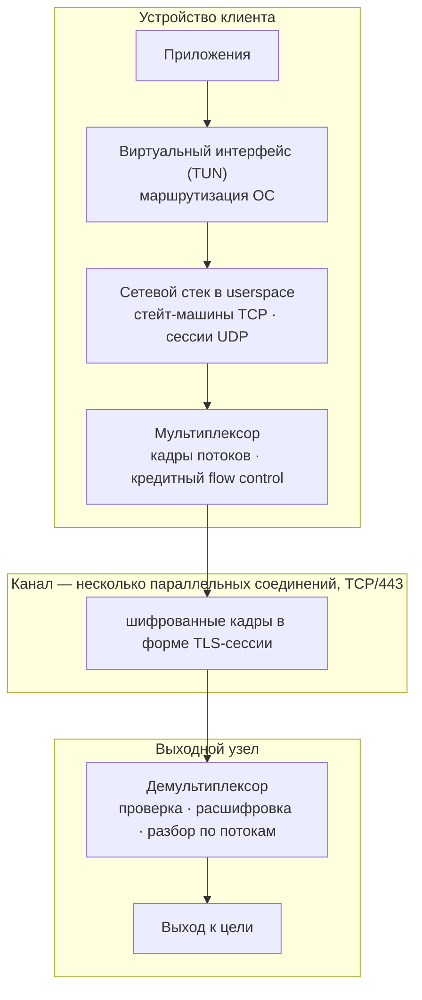

# NRXP

**Транспортный протокол, на котором работает [Netrunner VPN](https://netrunner-vpn.com).**

*Read this in [English](README.md).*

---

## Что это за репозиторий

Здесь лежит **публичное описание NRXP**: зачем он сделан, как устроен, на чём держится
его безопасность и где проходят границы модели.

Здесь нет мультиплексора (flow control на поток, multipath-переключение при отказе) и
прод-приложений клиента/сервера — они остаются закрытыми, живут в приватном репозитории,
и планов открыть их нет: в отличие от того, что описано ниже, это законченные, рабочие
реализации, чья ценность неотделима от точной настройки.

Два других компонента — формат кадра с крипто-кодеком и TLS-маскировочный слой на границе
рукопожатия — **опубликованы** как настоящий собираемый код в этом же репозитории, в
[`engine/`](engine) и [`logger/`](logger), с вычищенной калибровкой (не механизмом); сборка
и лицензия — в [ENGINE.md](ENGINE.md). Правило то же: публикуется *как* устроено решение
(алгоритмы, структуры данных, инварианты), скрываются *точные числа*, под которые настроен
конкретный деплой (параметры квантования длины записи, пороги ротации ключей, списки байт
TLS-отпечатка браузера) — первое не помогает построить детектор, второе — ровно то, из чего
детектор строится. Что именно включено, файл за файлом — см. ENGINE.md.

Если вы пришли оценить, насколько протокол состоятелен, читать стоит два раздела:
[модель безопасности](#модель-безопасности) и
[от чего NRXP не защищает](#от-чего-nrxp-не-защищает). Если интересно, почему в тексте
нет конкретных чисел, — [этому посвящён отдельный раздел](#почему-здесь-нет-цифр).

---

## Что такое NRXP

NRXP — транспортный протокол, который переносит целый сетевой уровень через недружелюбный
канал.

Это не прокси-протокол. Прокси пробрасывает соединения; NRXP несёт **IP-трафик**: клиент
поднимает виртуальный сетевой интерфейс, разбирает TCP и UDP в userspace и мультиплексирует
полученные потоки в один шифрованный канал, который уходит с устройства как обычный HTTPS
на TCP-порт 443.

Одной фразой: **мультиплексированный мультипутевой L3-VPN, который едет в форме обычной
веб-сессии.**

---

## Зачем он нужен

Массовые протоколы обхода — VLESS, VMess, Trojan — это прокси, завёрнутые в TLS. Они
работают, и на хорошем канале разницы с NRXP не видно. Разрыв открывается там, где люди
реально пользуются интернетом: мобильная сеть, перегруженный канал, роуминг, спутник,
Wi-Fi в отеле.

Три конкретные проблемы, ради которых сделан NRXP:

**Каждое новое соединение стоит полного круга по сети.** Прокси без мультиплексора на
каждый адрес открывает новый TCP и новый TLS — два RTT, и так к каждому домену. Страница,
которая дёргает десять доменов, платит это десять раз. При задержке 200 мс это несколько
секунд, в которые не происходит ничего, — и именно это люди имеют в виду, когда говорят
«через VPN интернет тупит».

**Обрыв одного канала убивает всё, что в нём было.** У одноканальных протоколов все потоки
живут в одном TCP-сокете. Потерянный пакет тормозит их все (head-of-line blocking), обрыв
соединения — завершает все. Зайти в лифт или переключиться с Wi-Fi на LTE означает
переподключение и, как правило, закачку заново.

**Окно приёма превращается в потолок скорости.** Распространённые мультиплексоры живут с
фиксированным окном на поток около 256 KiB. Скорость одного потока не может превысить
окно ÷ RTT — то есть при 300 мс это примерно 7 Мбит/с, сколько бы ни было в тарифе. Вот
настоящая причина «у меня 100 мегабит, а через VPN пять».

NRXP закрывает все три на уровне транспорта, а не настройками.

---

## Архитектура

Четыре уровня, у каждого одна задача:

| Уровень | За что отвечает |
|---|---|
| **Перехват (L3)** | TUN-интерфейс и правила маршрутизации ОС забирают трафик с устройства. Сетевой стек в userspace ([форк `smoltcp`](https://github.com/nineAp/nxrp-smoltcp)) ведёт стейт-машины TCP и отслеживает UDP-сессии в том же процессе — без `tun2socks` и без лишнего прыжка через локальный прокси. |
| **Потоки** | Каждое перехваченное соединение становится потоком со своим идентификатором. Потоки открываются, несут данные и закрываются внутри туннеля; сами каналы при этом остаются поднятыми. |
| **Кадры** | Данные потока режутся на кадры, каждый шифруется и аутентифицируется независимо и уходит в канал. Несколько кадров могут ехать в одной записи; один кадр никогда не разрывается между записями. |
| **Канал** | TLS-образная сессия на TCP/443 — именно её структуру и видит наблюдатель в сети. |

Ядро написано на Rust и не зависит от платформы. Платформенный код (TUN, маршрутизация,
жизненный цикл VPN-сервиса) лежит поверх; на Android идут нативные `.so` под каждую
архитектуру с Kotlin-биндингами через UniFFI — не обёртка над чужим бинарём.

---

## Как работает сессия

**Установление.** Клиент открывает канал и отправляет первое сообщение в форме браузерного
TLS `ClientHello`. Обе стороны кладут в него эфемерный публичный ключ и собственную
случайную соль, обе независимо вычисляют общий секрет — и ничего, что могло бы служить
ключом, по проводу не передаётся. Если клиенту заранее выдан долговременный публичный ключ
его узла, этот ключ вплетается в то же согласование: противник в разрыве, у которого ключа
нет, до общего секрета не доберётся, поэтому подмена узла проявляется как «данные не
расшифровываются», а не как предупреждение о сертификате.

Общий секрет никогда не используется как ключ напрямую. Он проходит через HKDF-SHA256,
который разворачивает его в несколько криптографически независимых значений: отдельный
ключ шифрования на каждое направление и отдельный ключ аутентификации. Роли зеркальны —
«ключ на запись» одной стороны есть «ключ на чтение» другой.

**Передача.** Каждый кадр запечатывается ChaCha20-Poly1305: конфиденциальность и
целостность даёт один примитив, одной операцией, и тег проверяется раньше, чем открытый
текст попадёт хоть в какой-то парсер. Одноразовые значения (nonce) не передаются вообще —
обе стороны считают их из материала сессии и собственного счётчика на каждое направление.
Отсюда два следствия, и второе важнее первого:

- Повтор nonce при одном ключе — единственный способ фатально сломать этот шифр —
  исключён по построению, а не проверкой во время выполнения.
- Потерянный, продублированный или переставленный кадр рассинхронизирует счётчики и
  немедленно ломает расшифровку. Повтор и перестановка внутри живой сессии здесь не
  «отражаются» — они структурно невозможны.

**Завершение.** Потоки закрываются независимо друг от друга. Каналы живут дольше потоков —
именно поэтому следующий поток открывается бесплатно.

---

## Мультиплексирование и flow control

Новый поток стоит **ноль RTT**. Каналы уже установлены и уже имеют ключи, поэтому
соединение с новым адресом — это кадр, а не рукопожатие. На канале с большой задержкой это
самая заметная на ощупь разница с VLESS или Trojan.

Flow control — **сквозной, кредитный**: получатель выдаёт отправителю явный бюджет и
пополняет его по мере разбора данных, так что медленная цель не может заставить туннель
буферизовать без предела.

Окно потока **стартует с единиц мегабайт и растёт по измеренному RTT до 16 MiB**. Именно
этот механизм снимает потолок фиксированного окна:

| RTT канала | Потолок при окне 256 KiB | Потолок NRXP |
|---|---|---|
| 50 мс | ~42 Мбит/с | ~336 Мбит/с |
| 300 мс | **~7 Мбит/с** | ~447 Мбит/с |
| 600 мс (спутник) | **~3,5 Мбит/с** | ~224 Мбит/с |

(Потолок = окно ÷ RTT. Окно растёт вместе с измеренным RTT, поэтому чем хуже канал, тем
больше выделяется запаса.)

---

## Мультипуть и отказоустойчивость

Сессия идёт по **нескольким параллельным каналам**, а не по одному. Поток липнет к своему
каналу, чтобы сохранялся порядок, и дальше:

- **Падение канала не рвёт поток.** Поток переезжает на живой соседний, кадр в полёте
  переотправляется. Закачка продолжается, приложение не видит ничего.
- **Head-of-line blocking делится, а не исчезает.** Потерянный пакет тормозит потоки
  только на одном канале, а не все потоки сессии.
- **Смена сети переживается.** Переход между Wi-Fi и мобильным интернетом не требует
  перезапуска сессии на уровне приложения.

Это не connection migration в смысле QUIC, где одно соединение переезжает на новый адрес.
Это резервирование пути: несколько независимых путей живут одновременно, и потоки свободно
перемещаются между ними.

---

## Модель безопасности

Все криптографические примитивы здесь — стандартные аудированные реализации. **Своей
криптографии в проекте нет ни одной арифметической операции.** Собственная только
композиция, и она намеренно устроена так, чтобы не вносить новых допущений.

| Задача | Примитив |
|---|---|
| Согласование ключей | X25519, эфемерный, одноразовый на сессию |
| Аутентификация узла | второй Диффи-Хеллман с долговременным ключом узла, в тот же ключевой материал |
| Выведение ключей | HKDF-SHA256, отдельные метки на направление и назначение |
| Шифрование и целостность | ChaCha20-Poly1305 |
| Аутентификатор кадра | HMAC-SHA256, привязан ко времени, проверка в постоянном времени |

Свойства, ради которых эта композиция собрана именно так:

**Узел аутентифицируется до передачи данных.** Перед подключением приложение получает
долговременный публичный ключ выбранного узла вместе с маршрутом через
аутентифицированный HTTPS API Netrunner. Приватная половина ключа никогда не покидает
узел. Второй обмен X25519 входит в ключевой материал сессии, поэтому посредник без
приватного ключа получит другие ключи, и соединение завершится до передачи данных
приложений. Продакшен-узлы работают в строгом режиме: клиент без учётных данных узла
отвергается, а откат к старому анонимному рукопожатию запрещён.

**Forward secrecy, которая действительно держит.** Приватный ключ сессии эфемерный и
расходуется ровно один раз: система типов не даёт использовать его повторно, а после
вычисления общего секрета его физически больше нет в памяти. Трафик, записанный сегодня,
не расшифровывается завтра — даже противником, который позже получил полный доступ к
серверу. Между сессиями не переносится никакой секрет.

**Целостность от самого шифра, а не приклеенная сбоку.** Исторические провалы протоколов
в этой области (канонический разбор — MTProto) почти все выросли из ручной сборки
целостности поверх шифра: хеш от открытого текста, непроверяемая набивка, порядок
сообщений на совести сервера. NRXP использует AEAD в штатном режиме, где шифрование и
аутентификация неразделимы по конструкции. Несовпавший тег — это разрыв соединения, а не
ошибка разбора.

**Повтор сессии обрубается на входе.** Счётчик защищает данные *внутри* живой сессии; но
записанную сессию можно попробовать переиграть позже как *новое* соединение — это
стандартный приём активного зондирования, которым пытаются отличить прокси от веб-сервера.
Поэтому каждый кадр несёт короткий аутентификатор, привязанный к ключу сессии и к текущему
временному интервалу. У самого первого сообщения ключей сессии ещё нет, поэтому его
аутентификатор строится на долговременном секрете узла и вдобавок привязан к параметрам
именно этого соединения — переигранное позже, оно не подойдёт даже внутри своего окна.
Отвергнутый кадр закрывает соединение, не давая наблюдателю различимого ответа. Допуск на
расхождение часов и сетевые задержки предусмотрен; за его пределами тег недействителен.

**Проверка в постоянном времени — как зафиксированный инвариант.** Проверка
аутентификатора всегда прогоняет полный набор кандидатов и сравнивает байты через
накопление разницы: без раннего выхода и без ветвления по промежуточному результату.
Длительность операции не зависит ни от того, что пришло, ни от того, совпало ли. Это
закреплено в коде инвариантом и тестом, а не получилось само собой.

**Посторонний на порту получает сайт.** Сканер, постучавшийся на порт, видит настоящий
работающий веб-сервер, а не что-то, что отказывается разговаривать и этим себя выдаёт.

---

## Неразличимость

Шифрование отвечает на вопрос «можно ли это прочитать». У протокола обхода есть вторая,
независимая задача: **наблюдатель не должен понять, что перед ним туннель.** Шифрованный
мусор виден как шифрованный мусор, и сам шифр здесь ничем не помогает.

Три слоя, каждый закрывает свой признак:

- **Форма.** И установление, и последующий поток укладываются в структуру, которую DPI
  относит к обычному HTTPS на TCP/443.
- **Отпечаток.** Выглядеть как TLS мало — надо выглядеть как *чей-то конкретный* браузер.
  Этот слой — тот самый [`netrunner-tls-engine`](ENGINE.md), упомянутый выше.
  Первый пакет сессии воспроизводит отпечаток реального современного браузера целиком,
  включая порядок и содержимое расширений: именно по нему сегодняшние классификаторы
  отличают «браузер» от «самописного клиента, который под браузер косит». Профиль
  ротируется по идентичности сессии, а не по попытке реконнекта: смена TLS-личности между
  переподключениями с одного адреса заметнее, чем стабильный отпечаток.
- **Статистика.** Длины сообщений — тоже сигнатура. Механизм батчинга и квантования —
  публичный код в [`netrunner-tls-engine`](ENGINE.md) (`nrxp::codec`): набивка
  применяется с параметрами, выбранными случайно на каждое соединение, а не из глобальной
  константы (точные диапазоны — единственное, что там скрыто); несколько кадров
  батчатся в одну запись, поэтому наблюдаемый размер определяется работой writer'а, а не
  содержимым конкретного запроса; служебный трафик идёт с джиттером, а не строго
  периодически. На крупных передачах набивка отключается — там она ничего не скрывает, а
  только режет скорость.

Набивка при этом лежит **под** шифрованием и **внутри** зоны аутентификации. Наблюдатель
не может ни отличить её от данных, ни срезать на транзите — в отличие от схем, где набивку
кладут снаружи запечатанного конверта.

**Скажем прямо:** цель здесь — выглядеть как HTTPS и не выделяться, и протокол непрерывно
дорабатывается в эту сторону. Это не заявление о доказанной неотличимости. Кто заявляет
такое про любой протокол — тот вам что-то продаёт.

---

## Границы туннеля: как работает интернет вокруг NRXP

Это не список уязвимостей протокола. NRXP отвечает за транспорт между устройством и
выходным узлом; до и после этого участка продолжают работать обычные уровни интернета.
Чтобы не смешивать их задачи, полезно посмотреть на весь путь целиком:

| Участок | Что его защищает | Что видно на этом уровне |
|---|---|---|
| Устройство → узел Netrunner | NRXP | Провайдер видит зашифрованное соединение с узлом и сетевую статистику, но не цели и содержимое потоков внутри туннеля |
| Узел Netrunner → сайт | HTTPS самого сайта, если он используется | Узел направляет соединение к нужному адресу; содержимое HTTPS остаётся зашифрованным между приложением и сайтом |
| Сайт и аккаунт пользователя | Механизмы самого приложения | Сайт видит IP выходного узла, а вход в аккаунт, cookies и переданные пользователем данные работают независимо от VPN |

**Выходной узел — граница маршрутизации.** Чтобы доставить трафик, любой обычный VPN должен
знать, к какому адресу его направить. Это не чтение содержимого: при HTTPS страницы,
пароли, сообщения и другие данные остаются под шифрованием самого сайта. NRXP защищает
сетевой участок до узла, а HTTPS — содержимое приложения до конечного сайта; эти слои
дополняют друг друга.

**VPN меняет сетевой маршрут, но не личность внутри приложения.** Если пользователь вошёл
в аккаунт или сохранил cookies, сайт может узнать этот аккаунт независимо от выбранного
VPN. Это свойство веб-приложений, а не транспортного протокола.

**Время используется для защиты от повторов.** Аутентификатор кадра допускает обычное
расхождение часов и сетевые задержки. Если часы устройства сбиты далеко за пределы
допуска, соединение не устанавливается, вместо того чтобы незаметно перейти в менее
защищённый режим.

**Криптографические гарантии дают стандартные примитивы.** NRXP наследует стойкость
X25519, HKDF-SHA256, ChaCha20-Poly1305 и HMAC-SHA256, не заменяя их собственной
криптографией.

**Доступ к узлу и личность пользователя — разные уровни.** NRXP проверяет, что клиенту
разрешено установить туннель с выбранным узлом. Конкретный аккаунт, тариф и права
пользователя определяет приложение и control plane выше транспортного протокола.

---

## Чего всё это стоит

Перечисленное мало чего стоит, если оно съедает скорость. На одинаковых нагрузках:

| | NRXP | VLESS | VMess | Trojan | Hysteria2 | TUIC |
|---|:---:|:---:|:---:|:---:|:---:|:---:|
| Новый поток | **0 RTT** | 2 RTT | 2 RTT | 2 RTT | 0 RTT | 0 RTT |
| Поток переживает падение пути | **да** | нет | нет | нет | нет | нет |
| Несколько путей одновременно | **да** | нет | нет | нет | нет | нет |
| Окно подстраивается под плохой канал | **да, до 16 MiB** | нет | нет | нет | да | да |
| Работает поверх TCP/443 | **да** | да | да | да | нет, UDP | нет, UDP |
| Полноценный L3-VPN без доп. процесса | **да** | нет | нет | нет | нет | нет |
| Forward secrecy | да | да | да | да | да | да |
| Маскировка длин | **да** | нет | опционально | нет | частично | нет |
| КПД канала на закачках | **96,3 %** | 96,4 % | 96,2 % | 96,4 % | 95,8 % | 95,8 % |

Последняя строка — главное: весь набор возможностей выше стоит **0,1 процентного пункта**
скорости. Оверхед на кадр падает примерно до **0,3 %** на полноразмерных кадрах.

**Почему TCP, а не QUIC** — возражение, которое прилетает первым. Протоколы поверх QUIC
быстрые, но это UDP. В корпоративных сетях, отелях, аэропортах, у части мобильных
операторов и в жёстко фильтруемых сегментах UDP режется или душится целиком, и быстрый
протокол, который не подключается, не стоит ничего. NRXP — это TCP на 443: он проходит
там, где проходит HTTPS. Скорость, которая есть всегда, лучше скорости, которой иногда нет.

---

## Почему здесь нет цифр

Этот документ описывает свойства, а не байты — но после публикации исходников
кадра/кодека/датаграмм под [`engine/`](engine) (см. [ENGINE.md](ENGINE.md)) «не здесь» уже
не значит «нигде»: геометрия кадра, ширина полей и сам механизм набивки/ratchet — в этом же
репозитории как настоящий код. Не опубликован теперь узкий набор откалиброванных чисел, под
которые настроен конкретный деплой: параметры квантования длины записи, пороги ротации
ключей, размер окна анти-replay, списки байт TLS-отпечатка браузера, временные интервалы.

Не потому, что безопасность держится на секретности схемы. Она на ней не держится:
**конфиденциальность и целостность стоят целиком на ключах**, и от публикации всех констант
не пострадали бы. Принцип Керкгоффса тут в силе, и модель безопасности выше — как и
механизм, опубликованный в netrunner-tls-engine, — можно оценить, не увидев ни одного из
этих чисел.

Но вторая задача — не быть *опознанным* — устроена иначе. Цензору не нужно читать трафик,
чтобы его блокировать; ему нужна сигнатура. Опубликованные константы — ровно тот материал,
из которого сигнатуры и строятся, в отличие от публикации алгоритма, который эти константы
использует. Поэтому числа живут в исходниках и внутренней документации, а не в публичном
файле — а алгоритму вокруг них это не требуется.

Если вы оцениваете NRXP для задачи, которой этого документа не хватает, —
[напишите нам](#контакты).

---

## Платформы

| Платформа | Состояние |
|---|---|
| Android | Нативные `.so` под каждую архитектуру (arm64-v8a, armeabi-v7a, x86, x86_64), Kotlin-биндинги через UniFFI |
| Linux | Поддерживается (для TUN нужны `cap_net_admin` / `cap_net_raw` или root) |
| Сервер | Linux, один бинарь, systemd, метрики Prometheus |

---

## Статус

NRXP работает в продакшене под Netrunner VPN. Протокол активно развивается, формат на
проводе между версиями **не** стабилен: клиент и сервер выкатываются вместе.

---

## Контакты

**Сообщения о проблемах безопасности:**
[netrunner_admin@netrunner-vpn.com](mailto:netrunner_admin@netrunner-vpn.com) или, если
удобнее не выходить из GitHub,
[приватный отчёт](https://github.com/nineAp/nrxp/security/advisories/new) во вкладке
Security — он виден только мейнтейнерам. Сообщения о реальной слабости в схеме или
в реализации приветствуются и будут разобраны. Пожалуйста, сначала приватно и дайте время
на исправление до публикации.

**Всё остальное:** [netrunner-vpn.com](https://netrunner-vpn.com) или issue в этом
репозитории.

---

## Лицензия

Текст в этом репозитории © Netrunner. Протокол NRXP и его реализации проприетарны; ничто
здесь не даёт права реализовывать, воспроизводить или распространять протокол.
